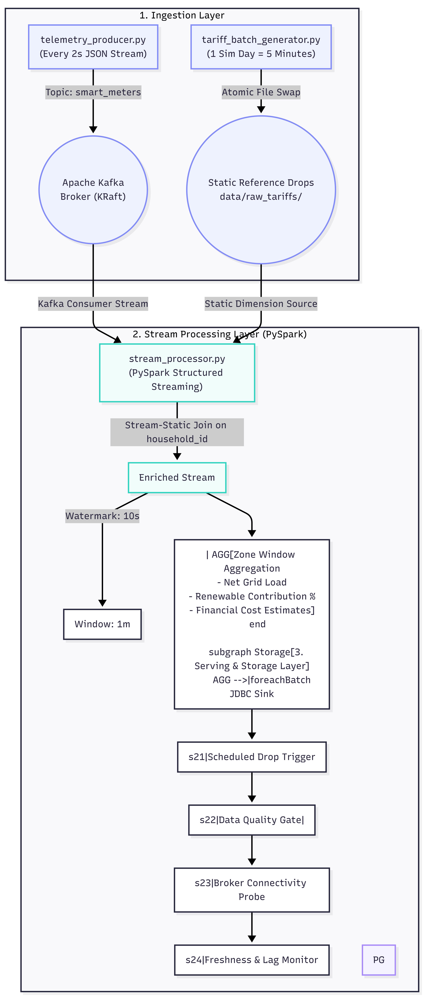

# Smart Grid Energy Monitoring: Kappa Architecture Data Pipeline

[](#architecture-overview)
[](#task-2-stream-processing-pyspark)
[](#task-1-data-generators-python)
[](#task-3-orchestration-apache-airflow)
[](#database-schema--serving-layer)

A production-grade Big Data pipeline simulating a **Smart Grid Energy Monitoring System** using the **Kappa Architecture** paradigm. 

---

## 1. Architecture Overview

### The Kappa Paradigm
Unlike traditional **Lambda Architecture** (which maintains dual batch and streaming codebases that often diverge in business logic and create synchronization overhead), **Kappa Architecture** treats all data as a continuous event stream. A single stream processing engine—**PySpark Structured Streaming**—handles both continuous ingestion and historical backfills.

Auxiliary datasets (such as daily static tariff drops) are integrated via **Stream-Static Joins**, allowing dimension enrichment without interrupting real-time stateful computation.

<p align="center">
  
</p>

---

## 2. Repository Layout

```
big-data-assignment/
├── avro_order_lab/                 # Companion Chapter 3 Lab: Avro serialization & DLQ
│   ├── order.avsc                  # Avro schema for order purchase transactions
│   └── order_producer_consumer.py  # Order stream with running average, retry & DLQ
├── config/
│   ├── __init__.py
│   └── settings.py                 # Centralized configuration & Structured JSON Logger
├── dags/
│   └── smart_grid_dag.py           # Task 3: Airflow DAG for batch trigger & health monitoring
├── data/
│   ├── checkpoints/                # PySpark Structured Streaming fault-recovery state
│   └── raw_tariffs/                # Canonical and archived daily tariff CSV drops
├── docker/
│   ├── docker-compose.yml          # Kafka (KRaft), PostgreSQL, and Airflow stack
│   └── init_db.sql                 # DDL for grid_zone_metrics & pipeline_health_logs
├── scripts/
│   ├── telemetry_producer.py       # Task 1: 2-second Kafka JSON telemetry generator
│   └── tariff_batch_generator.py   # Task 1: 5-minute simulated daily tariff CSV generator
├── streaming/
│   └── stream_processor.py         # Task 2: PySpark Structured Streaming application
├── tests/
│   └── test_pipeline.py            # Automated unit and integration test suite
├── requirements.txt                # Python dependencies
└── README.md                       # Complete technical documentation
```

---

## 3. Component Details & Architectural Decisions

### Task 1: Data Generators (Python)

#### 1. Telemetry Producer (`scripts/telemetry_producer.py`)
- **Cadence**: Emits telemetry every **2.0 seconds**.
- **Topic**: `smart_meters`.
- **Payload Schema**:
  ```json
  {
    "meter_id": "MTR-ZONE-N-0001",
    "household_id": "HH-0001",
    "power_consumption_kwh": 1.450,
    "solar_generation_kwh": 3.820,
    "grid_zone": "Zone-North",
    "timestamp": "2026-09-10T03:52:04.675924+00:00"
  }
  ```
- **Physical Simulation**: 
  - Generates realistic diurnal curves: solar power peaks at midday (sinusoidal zenith calculation) and drops to 0 at night.
  - Generates baseline household load with evening peaks and intermittent appliance surges.
- **Enterprise Features**:
  - Dual-adapter Kafka client (automatically supports `confluent-kafka` or `kafka-python`).
  - Partitioning by `household_id` to ensure strict in-order per-meter event guarantees.
  - Exponential backoff retry logic on network disconnects.
  - Graceful shutdown signal handling (`SIGINT`/`SIGTERM`).
  - `--dry-run` flag for verifying data generation without an active Kafka cluster.

#### 2. Tariff Batch Generator (`scripts/tariff_batch_generator.py`)
- **Cadence**: Simulates 1 day every **5 minutes (300 seconds)**.
- **Payload Schema**: `household_id,tariff_rate,billing_tier,subsidy_flag`.
- **Atomic File Drop Pattern**:
  To prevent race conditions and partial reads by downstream streaming engines, the script writes first to a hidden `.tmp_...` file and performs an atomic filesystem rename to update the canonical `data/raw_tariffs/tariffs_latest.csv`. It also preserves timestamped archives (`tariffs_YYYYMMDD_HHMMSS.csv`) for auditing and historical replays.
- Zero external dependencies: Uses Python standard library `csv`.

---

### Task 2: Stream Processing (PySpark Structured Streaming)

Located at `streaming/stream_processor.py`.

1. **Ingestion & Watermarking**:
   - Subscribes to Kafka topic `smart_meters`.
   - Strictly deserializes JSON using `StructType`.
   - Applies `.withWatermark("event_timestamp", "10 seconds")` to bound state store memory and handle late-arriving records.
2. **Stream-Static Join**:
   - Joins streaming telemetry with static tariff CSV on `household_id`.
   - In PySpark Structured Streaming, static datasets are evaluated per micro-batch, allowing daily tariff rate updates to be incorporated automatically without pipeline downtime.
3. **Zone Aggregations & Grid Math**:
   - **Net Grid Load**: $\text{Load} = \text{Consumption} - \text{Solar Generation}$.
     - Positive value = Net power drawn from grid.
     - Negative value = Net solar surplus fed back into grid.
   - **Renewable Penetration %**:
     $$\text{Renewable \%} = \left(\frac{\sum \text{Solar}}{\sum \text{Consumption}}\right) \times 100$$
   - **Cost Estimate**: Incorporates billing tiers and 15% green subsidy discounts:
     $$\text{Cost} = \text{Consumption} \times \text{Tariff Rate} \times (1 - \text{Subsidy Flag} \times 0.15)$$
4. **PostgreSQL JDBC Sink (`foreachBatch`)**:
   - Standard PySpark JDBC sinks cannot write windowed streaming updates directly.
   - `foreachBatch` transforms each micro-batch into an atomic transaction on the driver, flattening the window struct and committing to `grid_zone_metrics`.

---

### Task 3: Orchestration & Monitoring (Apache Airflow)

Located at `dags/smart_grid_dag.py`.

- **Schedule**: `*/5 * * * *` (Runs every 5 minutes, matching the 5-minute simulated day).
- **DAG Execution Flow**:
  1. `check_infrastructure_health`: Probes TCP sockets on Kafka broker (`localhost:9092`) and PostgreSQL (`localhost:5432`).
  2. `generate_daily_tariffs`: Invokes `tariff_batch_generator.py` to trigger the new simulated day's atomic drop.
  3. `validate_tariff_data_quality`: Data Quality Gate verifying file presence, non-zero row count, column compliance, and value bounds ($0.05 \le \text{rate} \le 1.50$).
  4. `monitor_stream_freshness`: Queries `grid_zone_metrics` in PostgreSQL to calculate stream ingestion lag. Records health heartbeats in `pipeline_health_logs`.

---

### Companion Chapter 3 Lab: Avro Orders with DLQ

Located in `avro_order_lab/`.
Directly addresses the assignment brief from `Assignement Chapter 3.pdf`:
- `order.avsc`: Schema definition for purchase transactions (`orderId`, `product`, `price`).
- `order_producer_consumer.py`:
  - Produces and consumes order events.
  - Maintains real-time **running average of prices**.
  - Implements **retry logic with backoff** for transient network glitches.
  - Routes unrecoverable / poison pill messages (e.g. negative prices) to a **Dead Letter Queue (DLQ)**.

---

## 4. Quick Start & Live Demonstration Guide

### Option 0: 🚀 Interactive Real-Time Web Dashboard (Recommended for Markers)
> **Highest Recommendation for University Presentations & Marker Evaluation!**
> Launches the high-performance, dark-mode real-time operations dashboard with zero build steps or npm installations.

```bash
python web_demo.py
```
This automatically boots the web server and opens [http://127.0.0.1:8000](http://127.0.0.1:8000) showcasing:
- **Chapter 3 Avro & DLQ Operations Center**: Live order ticker with schema validation, real-time running average price KPI, and price trend sparklines.
- **Marker's Interactive Chaos Console**: One-click buttons to inject valid orders, transient network timeouts (demonstrating 3-attempt backoff), and invalid poison pills (negative prices).
- **Dead Letter Queue (DLQ) Inspector**: Quarantines poisoned records and allows real-time message remediation and re-driving.
- **Smart Grid Kappa Monitor**: Real-time zone consumption vs. solar generation curves and Net Grid Load (`DRAW`/`FEED`).
- **Interactive Swagger API Documentation**: Available live at [http://127.0.0.1:8000/docs](http://127.0.0.1:8000/docs).

---

### Option A: ⚡ Instant Terminal Live Demo (Zero Docker & Zero Heavy Downloads)
> If you prefer a pure terminal dashboard, you can run:

```bash
python live_demo.py
```
This launches a real-time, interactive terminal dashboard demonstrating:
1. **Task 1 Streaming**: Telemetry generator streaming 2.0s events with diurnal solar physics.
2. **Task 1 Batch**: Airflow trigger dropping daily tariff CSVs with the atomic swap pattern.
3. **Task 2 Processing**: Real-time Stream-Static Join on `household_id`, computing Net Grid Load (`DRAW`/`FEED`), Renewable Penetration %, and financial billing metrics by zone.
4. **Task 2 Storage**: Committing micro-batches to the SQL database (`grid_zone_metrics`).
5. **Task 3 Orchestration**: Infrastructure connectivity audits, Data Quality validation gate, and health logging.

---

### Option B: Step-by-Step Standalone Execution (No Docker)
You can also run each component in separate terminal windows:

```bash
# Terminal 1: Initial tariff drop
python scripts/tariff_batch_generator.py --single-run

# Terminal 2: Stream telemetry (dry-run mode if no Kafka broker is active)
python scripts/telemetry_producer.py --dry-run

# Terminal 3: Run Airflow DAG health checks & quality validation
python dags/smart_grid_dag.py

# Terminal 4: Run Assignment Chapter 3 Avro DLQ Demo
python avro_order_lab/order_producer_consumer.py
```

---

### Option C: Containerized Deployment (Docker Compose)
If a fast internet connection is available and you wish to run the full containerized stack:
```bash
cd docker
docker compose up -d
```
- Kafka UI: [http://localhost:8085](http://localhost:8085)
- Airflow Webserver: [http://localhost:8080](http://localhost:8080)
- PostgreSQL: `localhost:5432` (`smart_grid_db`)

---

### Step 3: Run the Pipeline

#### A. Generate Initial Tariff Drop
```bash
python scripts/tariff_batch_generator.py --single-run
```

#### B. Start Real-time Telemetry Producer
To stream events to Kafka every 2 seconds:
```bash
python scripts/telemetry_producer.py --interval 2.0 --meters 50
```
*(To test without a Kafka broker, use `--dry-run`: `python scripts/telemetry_producer.py --dry-run --max-batches 5`)*

#### C. Start PySpark Structured Streaming Processor
To stream from Kafka and sink to PostgreSQL:
```bash
python streaming/stream_processor.py --sink postgres
```
*(Or stream directly to the terminal console for interactive verification: `python streaming/stream_processor.py --sink console`)*

#### D. Run Airflow Pipeline / Health Check
In Airflow, unpause and trigger `smart_grid_energy_monitoring_pipeline`.
You can also run the full health audit standalone from your terminal:
```bash
python dags/smart_grid_dag.py
```

#### E. Run Assignment Chapter 3 Avro Lab Demo
```bash
python avro_order_lab/order_producer_consumer.py
```

---

## 5. Automated Verification & Testing

Execute the automated unit and integration test suite covering simulation physics, schema validity, atomic file writes, and mathematical formulations:

```bash
python -m unittest discover -s tests -p "test_*.py" -v
```

### Output:
```text
test_telemetry_batch_schema (tests.test_pipeline.TestSmartGridTelemetrySimulator) ... ok
test_json_serialization (tests.test_pipeline.TestSmartGridTelemetrySimulator) ... ok
test_tariff_generation_fields_and_bounds (tests.test_pipeline.TestTariffBatchGenerator) ... ok
test_atomic_csv_write (tests.test_pipeline.TestTariffBatchGenerator) ... ok
test_cost_calculation_with_subsidy (tests.test_pipeline.TestStreamBusinessCalculations) ... ok
test_net_grid_load_calculation (tests.test_pipeline.TestStreamBusinessCalculations) ... ok
test_renewable_contribution_percentage (tests.test_pipeline.TestStreamBusinessCalculations) ... ok
test_dry_run_produce_and_flush (tests.test_pipeline.TestResilientKafkaProducerDryRun) ... ok

----------------------------------------------------------------------
Ran 8 tests in 0.005s

OK
```

---

## 6. PostgreSQL Database Schema

The database is pre-initialized via `docker/init_db.sql`:

```sql
CREATE TABLE grid_zone_metrics (
    window_start TIMESTAMP NOT NULL,
    window_end TIMESTAMP NOT NULL,
    grid_zone VARCHAR(50) NOT NULL,
    total_consumption_kwh NUMERIC(14, 4) NOT NULL,
    total_solar_generation_kwh NUMERIC(14, 4) NOT NULL,
    net_load_kwh NUMERIC(14, 4) NOT NULL,
    renewable_contribution_pct NUMERIC(6, 2) NOT NULL,
    total_cost_estimate NUMERIC(14, 4) NOT NULL,
    active_meters INT NOT NULL,
    batch_id BIGINT,
    updated_at TIMESTAMP WITH TIME ZONE DEFAULT CURRENT_TIMESTAMP,
    CONSTRAINT pk_grid_zone_metrics PRIMARY KEY (window_start, window_end, grid_zone)
);
```