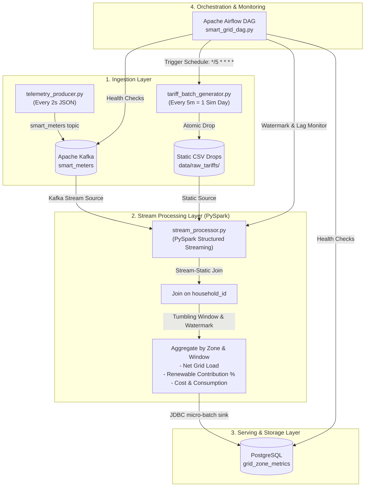

# Implementation Plan: Smart Grid Energy Monitoring Kappa Architecture Pipeline

Build an end-to-end Kappa architecture data pipeline for a Smart Grid Energy Monitoring system. The pipeline ingests high-frequency smart meter telemetry via Apache Kafka, joins streaming telemetry with simulated daily tariff reference drops in PySpark Structured Streaming, computes real-time grid load and renewable penetration metrics by zone, sinks results into PostgreSQL via JDBC, and orchestrates batch drops and pipeline health via Apache Airflow.

---

## User Review Required

> [!IMPORTANT]
> **Kafka Client Library**: We will structure the producer with standard fallback support for both `confluent-kafka` and `kafka-python` so it works out-of-the-box regardless of which C-compiler / wheels are available in your local environment.
>
> **Simulated Day vs. Cron Interval**: 1 simulated day = 5 minutes. The Airflow DAG will be configured with a schedule interval of `*/5 * * * *` (every 5 minutes) to trigger daily tariff updates and pipeline health checks.

---

## Architecture Overview (Kappa Architecture)

---

## Proposed Changes

### 1. Configuration & Project Foundation

#### [NEW] [`config/settings.py`](file:///e:/Github/big-data-assignment/config/settings.py)
- Centralized configuration module using environment variables with resilient defaults:
  - Kafka bootstrap servers, topics (`smart_meters`, `smart_meters_dlq`), consumer group.
  - PostgreSQL connection parameters (host, port, database, user, password, JDBC URL).
  - File system paths for raw tariff CSVs and checkpoint directories.
  - Simulation constants (2s telemetry rate, 5m simulated day).
- Logging configuration setting up structured JSON logging across all components.

#### [NEW] [`docker/docker-compose.yml`](file:///e:/Github/big-data-assignment/docker/docker-compose.yml)
- Multi-container environment containing:
  - Kafka (KRaft mode or Zookeeper + Kafka broker)
  - PostgreSQL 16 (with initialized database `smart_grid_db`)
  - Airflow Standalone / Scheduler & Webserver
  - Kafka UI (optional, for visual verification of topics and messages)

#### [NEW] [`docker/init_db.sql`](file:///e:/Github/big-data-assignment/docker/init_db.sql)
- Schema definitions:
  - `grid_zone_metrics`: Store aggregated windowed metrics (`window_start`, `window_end`, `grid_zone`, `total_consumption_kwh`, `total_solar_generation_kwh`, `net_load_kwh`, `renewable_contribution_pct`, `total_cost_estimate`, `active_meters`, `batch_id`).
  - `pipeline_health_logs`: Store heartbeats, Kafka offset checks, and lag metrics.
  - `tariffs_history`: Snapshot of tariff rates applied over time.
  - Indexes on `(grid_zone, window_start)` for rapid dashboard queries.

#### [NEW] [`requirements.txt`](file:///e:/Github/big-data-assignment/requirements.txt)
- Dependencies: `pyspark`, `confluent-kafka`, `kafka-python`, `psycopg2-binary`, `apache-airflow`, `pandas`, `pydantic`.

---

### 2. Task 1: Data Generators (Python)

#### [NEW] [`scripts/telemetry_producer.py`](file:///e:/Github/big-data-assignment/scripts/telemetry_producer.py)
- Emits real-time smart meter JSON telemetry to Kafka topic `smart_meters` every 2 seconds.
- Simulates realistic physical diurnal behavior:
  - Dynamic solar generation curve based on time-of-day (zero at night, peak midday).
  - Household baseline consumption with appliance spikes.
  - Multiple grid zones: `Zone-North`, `Zone-South`, `Zone-East`, `Zone-West`.
  - Payloads: `meter_id`, `household_id`, `power_consumption_kwh`, `solar_generation_kwh`, `grid_zone`, `timestamp`.
- Enterprise Senior DE features:
  - Structured JSON logging.
  - Retry logic with exponential backoff on broker network disconnects.
  - Dead-letter handling / fallback if serialization fails.
  - Graceful shutdown handling (`SIGINT`, `SIGTERM`).

#### [NEW] [`scripts/tariff_batch_generator.py`](file:///e:/Github/big-data-assignment/scripts/tariff_batch_generator.py)
- Simulates daily batch drop of tariff data (1 simulated day = 5 minutes).
- Generates CSV drops containing:
  - `household_id`, `tariff_rate`, `billing_tier` (`Tier-1 Residential`, `Tier-2 Commercial`, `Tier-3 Industrial`), `subsidy_flag` (`0` or `1`).
- Implements atomic file writes (write to `.tmp` file and atomic rename) to guarantee zero stream corruption during concurrent reads.
- Maintains `tariffs_latest.csv` pointer and timestamped archives `tariffs_YYYYMMDD_HHMMSS.csv`.
- Structured JSON logging.

---

### 3. Task 2: Stream Processing (PySpark Structured Streaming)

#### [NEW] [`streaming/stream_processor.py`](file:///e:/Github/big-data-assignment/streaming/stream_processor.py)
- PySpark Structured Streaming application:
  1. **Kafka Stream Reader**: Subscribes to `smart_meters` with watermarking (`withWatermark("timestamp", "10 seconds")`).
  2. **JSON Schema Enforcement**: Deserializes JSON using strict `StructType`.
  3. **Stream-Static Join**: Joins streaming telemetry with static tariff CSV on `household_id`. Demonstrates the Kappa Architecture paradigm where static dimensions enrich high-velocity streams.
  4. **Aggregations by Zone**:
     - Tumbling or sliding windows (e.g. 1-minute window, sliding every 30 seconds).
     - Net Grid Load: `sum(power_consumption_kwh - solar_generation_kwh)`.
     - Total Consumption: `sum(power_consumption_kwh)`.
     - Renewable Contribution %: `(sum(solar_generation_kwh) / sum(power_consumption_kwh)) * 100` (guarded against division by zero).
     - Estimated Cost: `sum(power_consumption_kwh * tariff_rate * (1 - subsidy_flag * 0.15))`.
  5. **PostgreSQL JDBC Sink (`foreachBatch`)**:
     - Writes micro-batches to PostgreSQL using idempotent `ON CONFLICT DO UPDATE` or transactional batch insert.
     - Checkpointing configured for exactly-once recovery.
  6. **Inline Architectural Documentation**: Explains stream-static join mechanics, state store behavior, watermark eviction, and Kappa design principles.

---

### 4. Task 3: Orchestration (Apache Airflow)

#### [NEW] [`dags/smart_grid_dag.py`](file:///e:/Github/big-data-assignment/dags/smart_grid_dag.py)
- Airflow DAG configured with `@every 5m` schedule matching the 5-minute simulated day:
  - `check_kafka_health`: Validates Kafka broker connectivity and topic metadata.
  - `check_postgres_health`: Pings PostgreSQL database and checks table readiness.
  - `generate_daily_tariffs`: Runs `tariff_batch_generator.py` to publish the new simulated day's tariff CSV.
  - `validate_tariff_data_quality`: Verifies generated CSV integrity (schema, non-empty, valid tariff ranges).
  - `monitor_streaming_health`: Queries PostgreSQL `grid_zone_metrics` to ensure fresh records are being committed within the last 5 minutes.
- Implements structured logging, task callbacks on failure, retry delays, and comprehensive inline architectural annotations.

---

### 5. Documentation & Verification

#### [NEW] [`README.md`](file:///e:/Github/big-data-assignment/README.md)
- Complete technical documentation with architecture explanations, Kappa design decisions, step-by-step startup guide, and verification steps.

#### [NEW] [`tests/test_pipeline.py`](file:///e:/Github/big-data-assignment/tests/test_pipeline.py)
- Python validation suite testing generator output schemas, JSON serialization, CSV generation, and business calculation logic.

---

## Verification Plan

### Automated Tests
- Run Python test suite: `python -m unittest discover -s tests -p "test_*.py"`
- Test data generator standalone executions:
  - Run `tariff_batch_generator.py` once to generate valid CSV and verify schema.
  - Verify JSON schema and data emission logic with mock Kafka client.
- Test PySpark processing logic (schema parsing, join, aggregation expressions) in isolation.

### Manual Verification
- Validate Airflow DAG syntax: `python -m py_compile dags/smart_grid_dag.py`
- Inspect SQL script syntax and compatibility with PostgreSQL 14/15/16.
- Provide end-to-end verification instructions for running with Kafka and PostgreSQL.
